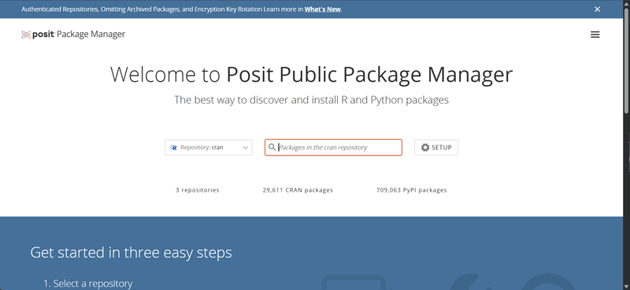

パッケージを追加しようとしたとき、新しいバージョンの R を求められることがあります。R 本体の更新ができないとき、パッケージの最新版でなくともよい場合の回避策のメモです。

## 要旨

R のパッケージを追加しようとしたとき、新しいバージョンの R が必要になった場合の回避策として、

- CRAN (The Comprehensive R Archive Network) のアーカイブから .zip, .tgz 等のファイルをダウンロードまたは直接指定してインストール
- `remotes::install_version()` や `pak::pkg_install()` のようなバージョンを指定できるパッケージ導入方法を使う
- 使用中の R 本体に合わせて、インストール元を過去の CRAN スナップショット（Posit Package Manager）にする

個人的なおすすめは、パッケージのバージョン指定も Posit Package Manager からのインストールも対応できる `pak` パッケージです。

## 問題の概要

生存期間分析、生存曲線の作図など医療統計でよく用いられる R のパッケージに `survminer` があります。

[mJOHNSNOW](https://mmedici.co.jp/mjohnsnow) の R 解析セミナーで `survminer` 導入時にうまくいかない事例が多発し、検証の結果、動作に必要なパッケージのひとつ `Matrix` が R 4.4 以降を要求するようになったため、R 4.3系以前の環境の方がインストールできなくなっていることが判明しました。

```
 警告メッセージ:
package ‘Matrix’ is not available for this version of R
‘Matrix’ version 1.7-3 is in the repositories but depends on R (>= 4.4)
‘Matrix’ version 1.7-3 is in the repositories but depends on R (>= 4.6)

A version of this package for your version of R might be available elsewhere,
see the ideas at
https://cran.r-project.org/doc/manuals/r-patched/R-admin.html#Installing-packages
```

他にも特定の R バージョンを要求するものがありましたが、ここでは `Matrix` を例に進めます。

まず、`pak::pkg_history()` を使って `Matrix` のこれまでのリリース情報から要求される R のバージョンを見てみます。


::: {.cell}

```{.r .cell-code}
# pacman がなければインストール
if (!("pacman" %in% .packages(all.available = TRUE))) {
  install.packages("pacman")
}
# パッケージの読み込み（なければインストール後に読み込む）
pacman::p_load(tidyverse)
pacman::p_load(pak)

pkg_history(pkg = "Matrix") %>% 
  rownames_to_column() %>%
  select(Package, Version, Date, dependencies) %>%
  # dependencies に含まれる "R" の要求バージョンを取り出す
  mutate(
    `R dependency` = map_chr(dependencies,
                             \(x) filter(x, package == "R") %>% pull(version))
  ) %>% 
  select(-dependencies) %>% 
  arrange(desc(Date)) %>% 
  head(10) 
```

::: {.cell-output-display}
<div class="kable-table">

|Package |Version |Date       |R dependency |
|:-------|:-------|:----------|:------------|
|Matrix  |1.7-3   |2025-03-05 |>= 4.4       |
|Matrix  |1.7-2   |2025-01-20 |>= 4.4       |
|Matrix  |1.7-1   |2024-10-17 |>= 4.4.0     |
|Matrix  |1.7-0   |2024-03-16 |>= 4.4.0     |
|Matrix  |1.6-5   |2024-01-06 |>= 3.5.0     |
|Matrix  |1.6-4   |2023-11-29 |>= 3.5.0     |
|Matrix  |1.6-3   |2023-11-13 |>= 3.5.0     |
|Matrix  |1.6-2   |2023-11-03 |>= 3.5.0     |
|Matrix  |1.6-1.1 |2023-09-08 |>= 3.5.0     |
|Matrix  |1.6-1   |2023-08-11 |>= 3.5.0     |

</div>
:::
:::


**バージョン 1.6-5 （2024-01-06 公開）ならば、R 4.3系でも使用できそうです。**

## 対策

### CRAN のアーカイブからインストール

CRAN からは過去のバージョンのパッケージも .zip 形式や .tar.gz (.tgz) 形式で入手することができます。OS、R のバージョン別になっているので適切なものを探す必要があるほか、関連（依存）パッケージがある場合はうまくいかない可能性があります。

例えば、R 4.3向けのパッケージでは

- Windows : [cloud.r-project.org/bin/windows/contrib/4.3/](https://cloud.r-project.org/bin/windows/contrib/4.3/)
- macOS Big Sur 以降, Apple Silicon : [cloud.r-project.org/bin/macosx/big-sur-arm64/contrib/4.3/](https://cloud.r-project.org/bin/macosx/big-sur-arm64/contrib/4.3/) 
- macOS Big Sur 以降, Intel CPU : [cloud.r-project.org/bin/macosx/big-sur-x86_64/contrib/4.3/](https://cloud.r-project.org/bin/macosx/big-sur-x86_64/contrib/4.3/) 

上記より、`Matrix_1.6-5.zip` (Windows) または `Matrix_1.6-5.tgz` (macOS) を working directory にダウンロードして


::: {.cell}

```{.r .cell-code}
install.packages("Matrix_1.6-5.zip", repos = NULL)
```
:::


とするか、上記アーカイブのアドレスを使って


::: {.cell}

```{.r .cell-code}
install.packages("https://cloud.r-project.org/bin/windows/contrib/4.3/Matrix_1.6-5.zip", repos = NULL)
```
:::


とすることでインストールが可能です。`repos = NULL` は省略しても補完されますが、明示的に指定したほうが確実です。

### パッケージのバージョンを指定してインストール

上記のアーカイブには、対象の R のバージョンにより存在しないパッケージのバージョンもあります。`remotes::install_version()` のようにバージョンを指定してインストールできる命令を使用すると、もう少し柔軟なインストールが可能です。


::: {.cell}

```{.r .cell-code}
# repos は最新の CRAN を指定するほうが良い
remotes::install_version(package = "Matrix", version = "1.6-5", repos = "cloud.r-project.org")
```
:::


### Posit Package Manager のスナップショットからインストール

Posit（旧 RStudio）社が運営する、日々の CRAN ライブラリーの内容が保管されているサイトです。
かつて Microsoft が運営していた同様のサイト MRAN (The Microsoft R Application Network) はソースコードの配布のみでしたが、Posit Package Manager は主要な OS (Windows, macOS, Linux) のバイナリパッケージが配布されているため、インストールも高速です。



まず、[packagemanager.posit.co/client](https://packagemanager.posit.co/client/) にアクセスして [SETUP] へ進みます。


- Operating System は今回は Windows を選択
- Snapshots は "Yes, always install packages from the date I choose"
- カレンダー画面から、上記リストで `Matrix 1.6-5` の次のバージョンがリリースされた前日（2024-03-15）を選択
- Environment は "RStudio IDE" を選択（次の Repository URL には影響なし）
- Repository URL の右側の [Copy] をクリック、または表示されている URL をコピー

この URL を `install.packages()` の `repos =` に指定することで、**関連パッケージを含めて  `Matrix 1.6-5` が最新バージョンであった 2024-03-15 時点のバージョンに揃えてインストールできる**ようになります。


::: {.cell}

```{.r .cell-code}
install.packages("Matrix", repos = "https://packagemanager.posit.co/cran/2024-03-15")
```
:::


## pak パッケージの活用

`pak` は CRAN だけでなく、GitHub や BioConductor といった別のサイトで配布されているパッケージや、ダウンロードしたファイルからも同じ命令でパッケージのインストールができる多機能なパッケージです。

基本的な使い方は


::: {.cell}

```{.r .cell-code}
# pak がなければ最新版をインストール
if (!("pak" %in% .packages(all.available = TRUE))) {
  install.packages("pak", repos = "cloud.r-project.org")
}

# package_name をインストールする（どちらを使っても良い）
pak::pak("package_name")
pak::pkg_install("package_name")
```
:::


で、`package_name` の部分の書き方により CRAN 以外のサイトや最新版以外のバージョンをインストールすることも可能です。


::: {.cell}

```{.r .cell-code}
# 通常（CRAN にある最新版をインストール）
pak::pak("dplyr")

# GitHub にある dplyr の最新開発版をインストールする
pak::pak("tidyverse/dplyr")

# バージョンを指定して `Matrix 1.6-5` をインストールする
pak::pak("Matrix@1.6-5")

# ダウンロードしたファイルからインストール
pak::pak("local::Matrix_1.6-5.zip")
```
:::


インストール元（レポジトリ）を検索、設定することもできます。


::: {.cell}

```{.r .cell-code}
# R 4.4.0 がリリースされた翌日（≒ R 4.3.3 環境から主流が切り替わる直前）の Posit Package Manager
# 実行中の OS に応じた URL が返される
pak::repo_resolve("PPM@R-4.4.0")
##                                              CRAN 
## "https://packagemanager.posit.co/cran/2024-04-25"

# survminer 0.5.0 がリリースされた翌日の Posit Package Manager
# Matrix は 1.x-y 形式でハイフンが入るためうまくいかない
pak::repo_resolve("PPM@survminer-0.5.0")
##                                              CRAN 
## "https://packagemanager.posit.co/cran/2024-10-31"

# 特定の日付の Posit Package Manager
pak::repo_resolve("PPM@2024-03-15")
##                                              CRAN 
## "https://packagemanager.posit.co/cran/2024-03-15"
```
:::

::: {.cell}

```{.r .cell-code}
# インストール元を Posit Package Manager で指定
install.packages("Matrix", repos = pak::repo_resolve("PPM@R-4.4.0"))

# 継続的に変更する場合（R を終了するまで有効）
pak::repo_add(CRAN = pak::repo_resolve("PPM@R-4.4.0"))
pak::repo_get()

## # A data frame: 6 × 5
##   name          url                                                    type     r_version bioc_version
## * <chr>         <chr>                                                  <chr>    <chr>     <chr>       
## 1 CRAN          https://packagemanager.posit.co/cran/2024-04-25        cran     *         NA          
## 2 BioCsoft      https://bioconductor.org/packages/3.20/bioc            bioc     4.4.3     3.20        
## 3 BioCann       https://bioconductor.org/packages/3.20/data/annotation bioc     4.4.3     3.20        
## 4 BioCexp       https://bioconductor.org/packages/3.20/data/experiment bioc     4.4.3     3.20        
## 5 BioCworkflows https://bioconductor.org/packages/3.20/workflows       bioc     4.4.3     3.20        
## 6 BioCbooks     https://bioconductor.org/packages/3.20/books           bioc     4.4.3     3.20      
```
:::
